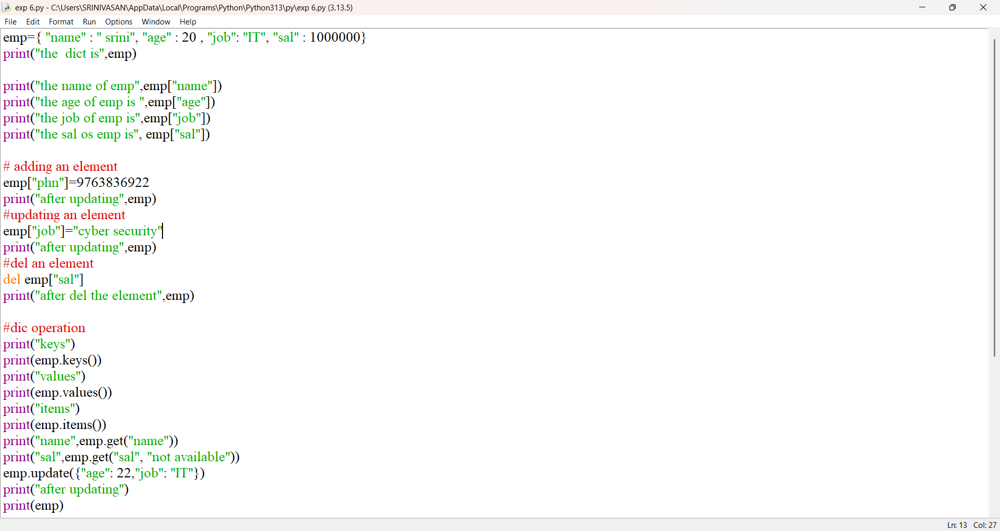
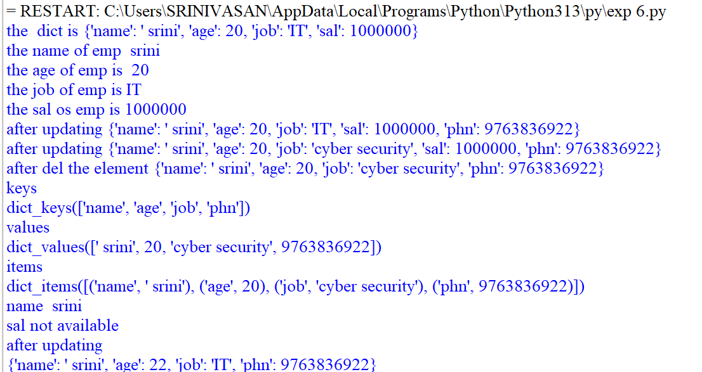
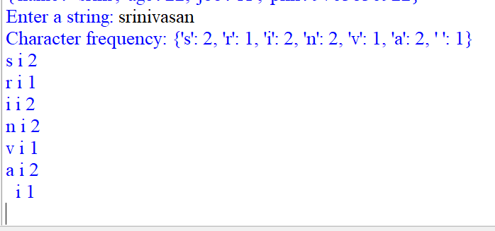

# PYTHON-LAB-EXPERIMENT-6
PYTHON PROGRAMMING LAB EXPERIMENT 

## Program 1: Dictionary Operations

## AIM:
To write a Python program to perform basic dictionary operations such as accessing, adding, updating, deleting, and retrieving elements.

## ALGORITHM:

1.Start the program.

2.Create an employee dictionary with name, age, job, and salary.

3.Display the dictionary and access individual values using keys.

4.Add a phone number to the dictionary.

5.Update the employee's job.

6.Delete the salary from the dictionary.

7.Display the keys, values, and items of the dictionary.

8.Use the get() function to retrieve values.

9.Use the update() function to modify multiple values.

10.Display the final dictionary.

11.Stop the program.

## source code

## output

## Program 2: Character Frequency

## AIM:
To write a Python program to find the frequency of each character in a given string using a dictionary.

## ALGORITHM:

1. Start the program.

2.Get a string from the user.

3.Create an empty dictionary to store character frequencies.

4.Read each character from the string one by one.

5.Check whether the character already exists in the dictionary.

6.If it exists, increase its count by 1.

7.If it does not exist, add it to the dictionary with count 1.

8.Display the character frequency.

9.Display each character and its corresponding count.

10.Stop the program.

## source code

## output

